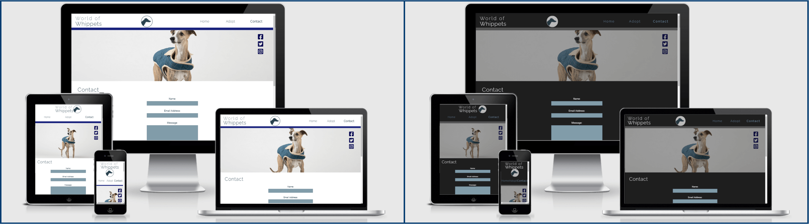
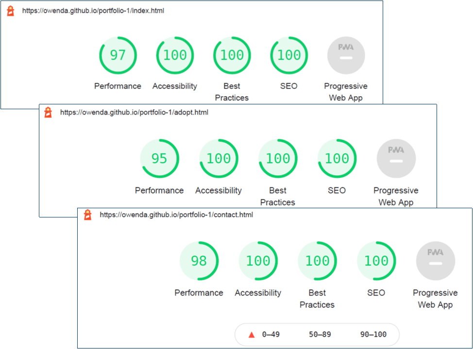
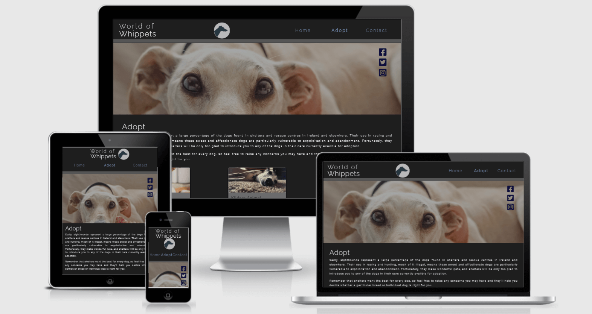

# World of Whippets
*World of Whippets* seeks to raise interest in, and dispell some common misconceptions about, whippets and other sighthounds as these dogs are often overlooked by would-be pet owners seeking a new companion.  
  
## Contents:
+ [Purpose](#purpose)
+ [Features](#features)
+ [Validation](#validation)
+ [Testing](#testing)
+ [Accessbility](#accessibility)
+ [Acknowledgements](#acknowledgements)

## Purpose  

### Target Audience:  
General public, Ireland and elsewhere.
  
### Background:  
Whippets are a dog breed which belong to the class "Sighthound". This class of dog is often used in racing and hunting (known as "coursing"), both legal and illegal. As an unfortunate side effect of their use for sport, two problems arise:  
1. Retired sighthounds and those found unfit for sport are frequently abandoned or surrendered to animal shelters. Many others are seized by animal welfare agencies if found to be mistreated.
2. The general population often associate these dog breeds with sports and do not see them as viable pets, making them difficult to rehome. Muzzling, which is a standard precaution in dog racing, creates the false impression that they are more likely to bite than other dog breeds. Their use in hunting small animals leads the general public to believe sighthounds are dangerous to small domestic animals, such as cats.  
  
An additional problem exists for the whippet breed specifically:  
  - Compared to other sighthounds, the general public is more aware of greyhounds, due to their visibility in racing and the ongoing public debate concerning its legality. Although much smaller, whippets closely resemble greyhounds, more so than any other sighthound breed and are often mistaken for greyhound puppies. Those who do not wish to adopt a greyhound may fail to consider a whippet simply because they are not aware of their existence.  
  
### Problem Statement:
Insufficient public awareness surrounding sighthounds and, in this case, whippets in particular, causes lower rates of adoption and significantly lengthens the rehoming process, placing greater strain on shelter resources.

#### Solution:  
Create a website which offers an introduction to whippets and other sighthounds, increasing public awareness. Provide positive imagery to reinforce their suitability to domestic settings and simultaneously counteract the common misconceptions which present an obstable to their adoption.

#### Special Considerations:  
1. The target audience is comprised of people who are not yet entirely familiar with whippets or with sighthouds generally. In order to have arrived at the website, the user must have some degree of curiousity on the subject, but it may also be their first introduction to the existence of this breed. Therefore, the project should not overwhelm the user with unecessary information but act as a bridge between the user's curiosity and contact with animal adoption services who can provide more specific information concerning individual dogs in their care.  
2. Equally, the project should ensure that its emphasis on whippets does not diminish the user's openness to other sighthound breeds. Rather, it should aim to promote adoption for all sighthounds while raising greater public awareness about the existence of whippets.  
3. Finally, while acknowledging the distressing circumstances which cause sighthounds to require rehoming in such great numbers ("call-to-action" prompts placed near this information may help to convey a sense of urgency), the project should create a largely positive emotional response within the user, emphasising an optimistic and constructive tone overall.

## Features 
### Navigation 
World of Whippets presents the user with a simple navigation which is repeated on each page, ensuring ease of use. In addition to visual feedback identifying which page is currently being viewed, `aria-current="page"` provides the same function for those using assistive technology. Hovering over a navigation item also provides visual feedback, ensuring the user knows precisely which item they are hovering on before selecting it.  
  
### Information Presentation
The intial information presented to the user explains the purpose of the website.  

Key points the website wishes to communicate are conveyed in a variety of ways, keeping the user engaged. For example, a "[Fact File](https://owenda.github.io/portfolio-1/#fact-file)" relays purely textual information that includes the average height range of the breed. The subject of height or size is touched upon again, in very different wording and with a different visual layout, in the "Common Myths" section which follows.  
  
The [Common Myths](https://owenda.github.io/portfolio-1/#myths) section uses a "Card" style layout to provide small bite-size pieces of information which contradict the common beliefs that contribute to the problems described in the [Purpose section](#purpose) above. Each "Myth" appears on a card which includes an image. These images are thematically related to their associated content and help to better convey the key point of each card.  
  
A shadow effect creates the impression that the cards are raised above the background. When hovering over an individual card, it appears to move slightly vertically upwards. Aside from being a pleasing and engaging effect, this also helps the user to focus on the specific information contained within that card.  
  
Follow-on information also includes a call-to-action link to the [Adopt](https://owenda.github.io/portfolio-1/adopt) page.  

### Adopt Page  
This page is headed by an suitably expressive image and makes use of the card style presentation to summarise contact details for a selection of animal shelters. A link to a [pre-populated Google Maps query](https://www.google.ie/maps/search/dog+shelters) follows, enabling the user to search for further shelters. The purpose of this query is not only to aid the user in seeking shelters local to them within Ireland, but to prompt users who may be based outside of Ireland to search within their own country or state.
  
### Forms
Each page ends with a newsletter sign-up form. The inputs on this form are all keyboard focusable and make appropriate use of the `label` tag to aid those who use screenreaders. Visually, a subtle border aids the user in identifying the selected input. This is also true of the form located on [the Contact page](https://owenda.github.io/portfolio-1/contact). Form validation is used to ensure data is entered before submission and that data is of the correct `type`.

### Dark Mode
     

Lower contrast styles have been coded to preserve branding and aesthetic appeal when the user's device preferences are set to "Dark Mode". For more on this, [see Accessibility below](#accessibillity).  
  
### Responsive Design  
*Overview of World of Whippets Home Page (via [ami.responsivedesign.is](http://ami.responsivedesign.is))*   
    
   
   World of Whippets is fully responsive. All pages and features are responsive and maintain aesthetic appeal and function regardless of screen size, in both light and dark mode. Additional imagery is displayed on the homepage for particularly large screens only.

   The layout of the "card" features adapts according to screen size, displaying either as 1 row of 6 cards, 2 rows of 3 cards, 3 rows of 2 cards or 1 column of 6 cards.
     
## Validation
1. [W3C](https://www.w3.org/)'s [Markup Validation Service](https://validator.w3.org/) reports the following:
    * Home Page (index.html)  
        - No errors or warnings to show.
    * Adopt (adopt.html)  
        - No errors or warnings to show.
    * Contact (contact.html)  
        - No errors or warnings to show.

2. [W3C](https://www.w3.org/)'s [CSS Validation Service](https://jigsaw.w3.org/css-validator/) reports the following:

    * CSS (style.css)
        - No errors found (CSS level 3 + SVG).
  
  ## Testing  
  *Lighthouse report summaries for each page:*   
   
    
  
  1. Manual testing was carried out to ensure all link works as intended, with external links opening in a new tab.   
  2. Functions such as form submission and form validation were manually tested by the developer and can be tested by submitting sample data.
  3. The developer manually tested to ensure elements such as navigation links, form inputs and so on can be navigated with the tab key ([see Accessibility](#accessibility)).
  4. A [Lighthouse report](https://developers.google.com/web/tools/lighthouse) was generated for all pages, scoring each page on Performance, Accessibility, Best Practices and SEO.
  5. Google Chrome's Dev Tools was used throughout the development process to ensure responsiveness.

  ## Accessibility  

  1. Lighthouse reports an accessability score of 100 on all pages when vied in the standard mode. In dark mode, the reduction in contrast reduces the scores for the Home and Adopt pages to 97.
  2. All `img` elements contain alt-text.
  3. ARIA labels are used on all visual elements which operate as interactive controls, for example, social media icons.
  4. Where used, ARIA labels indicate that external links will open in a new tab.
  5. Page contents are broken into semantically meaninful sections, such as Header, Nav, Main and Footer.
  6. Navigation items, form inputs, buttons and links are all keyboard-focusable and can be navigated with the tab key.
  7. Foreground and background colours were checked to ensure adequate contrast (using [WebAIM](https://webaim.org/) and [Contrast Checker](https://coolors.co/contrast-checker)).
  8. Dark Mode styles, however, use lower contrast colours and reduce the brightness of images, reducing eye strain and improving accessibility for users with light-sensitivity.

  *Overview of Adopt page in dark mode (via [ami.responsivedesign.is](http://ami.responsivedesign.is))*   
  

## Acknowledgements

### Code Credits:
1. While the World of Whippets is original material composed and coded by the author, thanks is due to [Code Institute](https://codeinstitute.net/ie/) for tutorials and lessons preceding this project.
2. "Whippet Fact File" table composed with reference to [this tutorial by Mark Heath](https://markheath.net/post/simple-tables-with-css-grid-layout).  
3. Card design was partly based on this [W3Schools HowTo](https://www.w3schools.com/howto/howto_css_cards.asp).
3. Favicon added by following [these steps](https://lazaroibanez.com/how-to-add-a-favicon-to-github-pages-403935604460).

### Tools & Resources:
1. [Material Design](https://material.io/)'s [Color Tool](https://material.io/resources/color/) was used in devising the colour scheme.
2. Both [WebAIM](https://webaim.org/) and [Coolors.co](https://coolors.co)'s [Contrast Checker](https://coolors.co/contrast-checker) were used to compare colour contrast.
3. Images were largely sourced using [Pexels](https://www.pexels.com/) and [Unsplash](https://unsplash.com/).
4. Images were compressed using [TinyPNG](https://tinypng.com/).
5. As will be seen within the code itself, Font Awesome was used to source icons on several pages.
6. The [W3C Markup](https://validator.w3.org/) and CSS [Markup Validation](http://jigsaw.w3.org/css-validator/) Services were used to ensure the code within this project was valid.
7. The site [ami.responsivedesign.is](http://ami.responsivedesign.is) was used to generate screenshots demonstrating the site's responsiveness on common screen sizes.  
8. Acknowledgement and thanks are due to the author's assigned mentor for guidance gratefully received.

### Image Credits:
*Site-wide*
1. Header Logo Image (whippet-silhouette-logo.png): Amended from [Public Domain Pictures](https://www.publicdomainpictures.net/en/view-image.php?image=74959&picture=grey-hound&large=1) image.  
  
*Home Page*  
1. Hero Image (whippet-in-front-of-sea.png): Photo by [Diana D. Reinoso - Pexels](https://www.pexels.com/photo/black-and-white-short-coat-dog-73639). 
2. Images shown on screens 1615px wide and above (from left-to-right):
    * Photo by [Dada Mar - Unsplash](https://unsplash.com/photos/2B6b5tyWDWk).
    * Photo by [Marius Cern - Unsplash](https://unsplash.com/photos/Im8Vnagv3r8).
    * Photo sourced via [PickPik.com](https://www.pickpik.com/dog-whipet-hound-the-head-of-greyhound-racing-profile-green-118892).
2. Card Image (sleeping-whippet-by-sergio-souza.png): Photo by [Sergio Souza - Pexels](https://www.pexels.com/photo/cute-whippet-dog-sleeping-on-cozy-bed-5046656/).
3. Card Image (small-italian-greyhound.png): Photo by [@belettenoir - Pexels](https://unsplash.com/photos/Sjf4NZIYaL0).  
4. Card Image (whippet-on-leash.png): Photo by [Mitchell Orr - Unsplash](https://unsplash.com/photos/iEXaSu3U1po).
5. Card Image (dogs-with-cat.png): Photo by [Chewy - Unsplash](https://unsplash.com/photos/gWzTum_yMCg).  
6. Card Image (woman-kissing-whippet-cheek.png): Photo by [Chewy - Unsplash](https://unsplash.com/photos/sdF1Zc6-OQw).  
7. Card Image (sighthound-puppy-looking-at-camera.jpg): Photo by [Chris Arthur-Collins - Unsplash](https://unsplash.com/photos/SZ3rC3M8L0k). 
  
*Adopt*  
1. Card Image (whippet-close-up-portrait.png): Photo by [Mitchell Orr - Unsplash](https://unsplash.com/photos/mHeS96HeeQE).
2. Card Image (sighthound-on-carpet.png): Photo by [Sean M. - Pexels](https://www.pexels.com/photo/carpet-dog-doggo-filter-147338/).
3. Card Images (floppy-eared-whippet.png): Photo by [S J - Pexels](https://unsplash.com/photos/508khDxcc5I).
4. Card Images (profile-portrait-dog.png): Photo by [Dada Mar - Unsplash](https://unsplash.com/photos/vW3TSK0KQAc).
5. Card Image (sighthound-lying-on-bed.png): Photo by [Enzo Muñoz - Pexels](https://www.pexels.com/photo/a-brown-dog-with-blue-shirt-lying-on-the-bed-5493602/).
6. Card Image (woodland-whippet.png): Photo by [Mitchell Orr - Unsplash](https://unsplash.com/photos/UTLouG6wK4Y).
  
*Contact*  
1. Hero Image (whippet-in-padded-jacket.png): Photo by [S J on Unsplash](https://unsplash.com/photos/Blsz7BwY6ds).