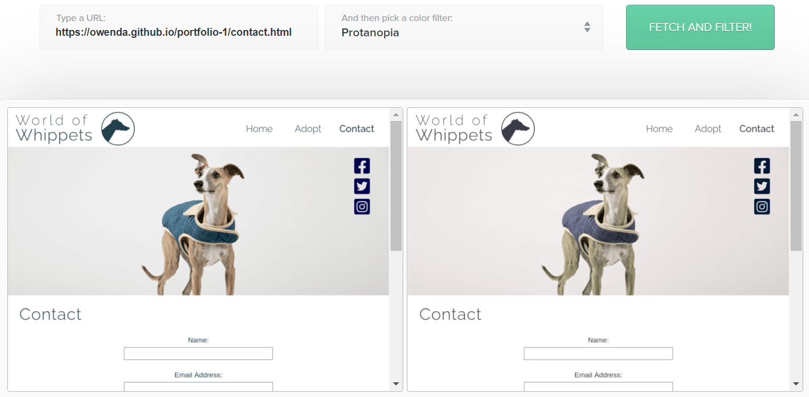

# World of Whippets
*World of Whippets* seeks to raise interest in, and dispel some common misconceptions about, whippets and other sighthounds as these dogs are often overlooked by would-be pet owners seeking a new companion.  
     
  
## Contents:
1. [Purpose](#purpose)
2. [Tech Stack](#tech-stack)
3. [Features](#features)
    + [Navigation](#navigation)
    + [Information Presentation](#information-presentation)
    + [Adopt Page](#adopt-page)
    + [Forms](#forms)
    + [Dark Mode](#dark-mode)
    + [Responsive Design](#responsive-design)
4. [Testing](#testing)
    + [Validation](#validation)
    + [Manual Testing](#manual-testing)  
    + [Testing Tools](#testing-tools)
    + [Accessibility](#accessibility)
5. [Deployment](#deployment)
6. [Acknowledgements](#acknowledgements)   
  
## Purpose  

### Target Audience:  
General public, Ireland and elsewhere.
  
### Background:  
Whippets are a dog breed which belong to the class "Sighthound". This class of dog is often used in racing and hunting (known as "coursing"), both legal and illegal. As an unfortunate side effect of their use for sport, two problems arise:  
1. Retired sighthounds and those found unfit for sport are frequently abandoned or surrendered to animal shelters. Many others are seized by animal welfare agencies if found to be mistreated.
2. The general population often associate these dog breeds with sports and do not see them as viable pets, making them difficult to rehome. Muzzling, which is a standard precaution in dog racing, creates the false impression that they are more likely to bite than other dog breeds. Their use in hunting small animals leads the general public to believe sighthounds are dangerous to small domestic animals, such as cats.  
  
An additional problem exists for the whippet breed specifically:  
  - Compared to other sighthounds, the general public is more aware of greyhounds, due to their visibility in racing and the ongoing public debate concerning its legality. Although much smaller, whippets closely resemble greyhounds, more so than any other sighthound breed and are often mistaken for greyhound puppies. Those who do not wish to adopt a greyhound may fail to consider a whippet simply because they are not aware of their existence.  

     
  
### Problem Statement:
Insufficient public awareness surrounding sighthounds and, in this case, whippets in particular, causes lower rates of adoption and significantly lengthens the rehoming process, placing greater strain on shelter resources.

#### Solution:  
Create a website which offers an introduction to whippets and other sighthounds, increasing public awareness. Provide positive imagery to reinforce their suitability to domestic settings and simultaneously counteract the common misconceptions which present an obstacle to their adoption.  

#### Special Considerations:  
1. The target audience is comprised of people who are not yet entirely familiar with whippets or with sighthounds generally. In order to have arrived at the website, the user must have some degree of curiosity on the subject, but it may also be their first introduction to the existence of this breed. Therefore, the project should not overwhelm the user with unnecessary information but act as a bridge between the user's curiosity and contact with animal adoption services who can provide more specific information concerning individual dogs in their care.  
2. Equally, the project should ensure that its emphasis on whippets does not diminish the user's openness to other sighthound breeds. Rather, it should aim to promote adoption for all sighthounds while raising greater public awareness about the existence of whippets.  
3. Finally, while acknowledging the distressing circumstances which cause sighthounds to require rehoming in such great numbers ("call-to-action" prompts placed near this information may help to convey a sense of urgency), the project should create a largely positive emotional response within the user, emphasising an optimistic and constructive tone overall.
  
     

## Tech Stack  
1. HTML
2. CSS
  
## Features  

### Navigation 
  World of Whippets presents the user with a simple navigation which is repeated on each page, ensuring ease of use.  
       
  In addition to visual feedback identifying which page is currently being viewed, `aria-current="page"` provides the same function for those using assistive technology. Hovering over a navigation item also provides visual feedback, ensuring the user knows precisely which item they are hovering on before selecting it.  

  For those making use of a screen reader, the site name is announced by default (drawn from the page's title tag); therefore, setting `aria-hidden=true` on the "World of Whippets" text in the header ensures it is not needlessly repeated. As this text is also a link to the home page, this also ensures screen readers do not offer the link twice in succession. Additionally, setting `tabindex` to a negative number (e.g. `-1`) means this element is not keyboard-focusable and cannot be tabbed through. This avoids confusion for users employing a screen reader with a keyboard while retaining the 'link-to-home' convention which many users expect to encounter in a site name or logo.  

  It may be on interest to know that setting `aria-hidden=true` on an element such as this `#site-name` div *without* accounting for focusable children within the element will lower a Google Lighthouse score for the page in question.

  Navigation links are followed by social media links, nested inside the site's hero image. Being purely decorative, the header image is not announced or described by screen readers as this would needlessly delay the listener's progression to the main content.  
  
### Information Presentation
The initial information presented to the user explains the purpose of the website.  
     

Key points the website wishes to communicate are conveyed in a variety of ways, keeping the user engaged. For example, a "Fact File" relays purely textual information that includes the average height range of the breed. The subject of height or size is later covered, in very different wording and with a different visual layout, in the "Common Myths" section which follows.  

### Common Myths
  
The Common Myths section uses a "Card" style layout to provide small bite-size pieces of information which contradict the common beliefs that contribute to the problems described in the [Purpose section](#purpose) above. Each "Myth" appears on a card which includes an image. These images are thematically related to their associated content and help to better convey the key point of each card; images are complete with descriptive alt-text.  

     
  
A shadow effect creates the impression that the cards are raised above the background. When hovering over an individual card, it appears to move slightly vertically upwards. Aside from being a pleasing and engaging effect, this also helps the user to focus on the specific information contained within that card.  
  
These effects are repeated for the card layout used on [the site's Adopt page](https://owenda.github.io/portfolio-1/adopt) and further elaborated upon in the next section. Follow-on information also includes a call-to-action link to Adopt page.

### Adopt Page  
    

This page is headed by a suitably expressive image and makes use of the card-style presentation to summarise contact details for a selection of animal shelters. Each card contains a different image above the name of an animal shelter with an icon indicating the name can be clicked to visit an external link which opens in a new window.  
  
  *Overview of card features:*  
    

Beneath the shelter name, the user is given the address of the shelter to quickly ascertain whether it's near to their location, followed by a map marker icon and a link to "View on map", opening a new tab displaying the shelter's exact location in a Google Maps. Finally, a phone number is shown, accompanied by a phone-shaped icon. Phone numbers are clickable and, on compatible devices, can be tapped to dial (or in some cases, push the call from the desktop browser to a compatible device).  
   
  *Card features as announced by screen readers*  
    

For those using screen readers, the image alt-text is read for each card. After this, a heading is announced, followed by a prompt to visit the shelter's website (with an indication that this link will open in a new tab). The shelter address is then read and followed by a prompt to open this location in Google Maps (again, notifying the user that this link will open in a new tab). Finally, the screen reader announces the presence of a linked telephone number and reads the number aloud, one digit at a time. It is important to state that numbers are read individually, as ill-formatted telephone numbers can be erroneously announced tenth-units, hundredth-units and so on (e.g. 'thirty-four' instead of 'three four', or 'nine-hundredth-and-four' instead of 'nine zero four').

Following this section of the page, a link is given to a [pre-populated Google Maps query](https://www.google.ie/maps/search/dog+shelters), enabling the user to search for further shelters. The purpose of this query is not only to aid the user in seeking shelters local to them within Ireland, but to prompt users who may be based outside of Ireland to search within their own country or region.  
  
### Forms
Each page ends with a newsletter sign-up form. The inputs on this form are all keyboard focusable and make appropriate use of the `label` tag to aid those who use screen readers. Visually, a subtle border aids the user in identifying input fields, while a focus ring appears on any input when selected.  
    

This is also true of the form located on [the Contact page](https://owenda.github.io/portfolio-1/contact). In both cases, form validation is used to ensure data is entered before submission and that data is of the correct `type`.  
   

### Dark Mode  
    

  Lower contrast styles have been coded to preserve branding and aesthetic appeal when the user's device preferences are set to "Dark Mode". This adds considerable value for user's who suffer from light sensitivity, migraines and certain visual disturbances, as well as those who simply wish to browse in low-light environments. For more on this, [see Accessibility below](#accessibility).  
    
### Responsive Design  
  *Overview of World of Whippets Home Page (via [ami.responsivedesign.is](http://ami.responsivedesign.is))*   
    
   
  World of Whippets is fully responsive in both dark and standard (light) mode. All pages and features respond appropriately and automatically to maintain aesthetic appeal and function regardless of screen size. Additional imagery is displayed on the homepage for particularly large screens only.  

  It should also be noted that font sizes are determined in relative units (namely, rem), allowing them to scale according to the user's preferred font size; this is relevant not only to larger screens (whose users may make use of a browser's zoom feature with or without increasing their standard font size).

    

  At this larger screen size, a new layout is applied to the "Common Myths" cards, as well as those on the Adopt page. Depending on the user's device, cards may be displayed as:  
  + 1 row of 6 cards (wide screens)  
  + 2 rows of 3 cards (large-to-medium screen sizes, typical of laptops)  
  + 3 rows of 2 cards (medium-to-small screens, typical of tablets)  
  + 1 tall column of 6 cards (smaller screens, typical of smartphones)  
   
  
   
  ## Testing  

  The developer used an iterative design methodology throughout, beginning with a basic prototype of any given feature or aspect of the site, testing it, and refining it accordingly until an optimum result was achieved. Some tests, such as HTML and CSS Validation, were also repeated throughout to minimise error.  

  ### Validation
1. [W3C](https://www.w3.org/)'s [Markup Validation Service](https://validator.w3.org/) reports the following:
    * Home Page (index.html)  
        - No errors or warnings to show.
    * Adopt (adopt.html)  
        - No errors or warnings to show.
    * Contact (contact.html)  
        - No errors or warnings to show.

2. [W3C](https://www.w3.org/)'s [CSS Validation Service](https://jigsaw.w3.org/css-validator/) reports the following:

    * CSS (style.css)
        - No errors found (CSS level 3 + SVG).  
          

   ### Manual Testing
  1. Manual testing was carried out to ensure all link works as intended, with external links opening in a new tab.   
  2. Functions such as form submission and form validation were manually tested by the developer and can be tested by submitting sample data.
  3. The developer manually tested to ensure elements such as navigation links, form inputs and so on can be navigated with the tab key.  
  4. Picture fall-backs were tested by opening pages in Google Chrome and inspecting the source. The expected result being that Chrome would display the AVIF file. This was then repeated in Microsoft Edge with the expectation being that Edge would display the fallback PNG/JPG file. There should be no discernable difference to the end-user. The expected result was achieved in each case.  
  5. Additional manual tests were carried out as part of an Accessibility Audit. These are described in the following section ([jump to Accessibility](#accessibility)).
  
  ### Testing Tools  
  
  1. Foreground-to-background colour contrast was tested with both [WebAIM](https://webaim.org/resources/contrastchecker/) and [Coolors.co](https://coolors.co/contrast-checker) contrast checking tools.
     

  4. [PingDom](https://tools.pingdom.com) was used to test page-load speeds and pages sizes. This helped to guide actions such as [image optimisation](#performance).
    
  6. [Page Speed Insights](https://pagespeed.web.dev/) was used for the same purpose. Notably, however, Page Speed Insights highlights a disparity in performance between the Mobile and Desktop user experiences which should be reduced in any future development.
      
  4. Throughout development, [Lighthouse](https://developers.google.com/web/tools/lighthouse) reports were generated for all pages, scoring each page on Performance, Accessibility, Best Practices and SEO. The Chrome browser was primarily used, however, Google's Lighthouse tool can also be used within Microsoft's Edge browser, and this was also employed at times, as these two browsers interact with the site's images differently ([see Performance](#performance)). Of course, it should be borne in mind that Lighthouse scores can fluctuate with CPU load, however, every effort was made to keep the testing environment as similar and stable as possible.  
       
  *The image below provides a snapshot of Lighthouse scores on all three pages at one moment in time during the development process*  
    
   *Below: Lighthouse scores at time of project completion*  
    

  
  5. Google Chrome's Dev Tools was used throughout the development process to ensure responsiveness.
  6. The website [Can I Use?](https://caniuse.com/?search=avif) was used to check browser support for AVIF image formats, as a result of which, fall-back formats are also provided.  
    

  7. Additional tools were used to carry out an Accessibility Audit as described in the next section.

  ## Accessibility  

  ### Accessible Design

  1. All `img` elements contain alt-text.
    + Purely decorative elements, namely the header images on each page, use `background:url()` properties instead of `img` tags; this allows screen readers to skip this decorative content and bring the reader directly to the main content of the page. `img` tags were reserved for images within the main content as these images are thematically related to the text which accompanies them. Alt-text relays a description of these images to ensure an analogous experience between users with visual impairment and users without visual impairment.  
  2. ARIA labels are used on all visual elements which operate as interactive controls, for example, social media icons which operate as links.  
  3. Input labels appear alongside and are associated with their respective fields, ensuring screen readers can correctly identify each form field and submit button.  
  4. ARIA labels indicate that external links will open in a new tab.  
  5. Page contents are broken into semantically meaningful sections, such as Header, Nav, Main and Footer.
  6. Headers are sequential in use (e.g. H3 nested under H2, not illogical jumps, etc.)  
  7. As a point of both usability and accessibility, the site can be rotated and viewed in landscape mode on mobile devices.
  8. Font sizes are determined in rem, allowing them to scale according to the user's browser or device font-size settings.
  9. Foreground and background colours were checked to ensure adequate contrast ([as described in Testing](#testing)).  
  10. Dark Mode styles, however, use lower contrast colours and reduce the brightness of images, reducing eye strain and improving accessibility for users with light sensitivity.
      + This variation is entirely within the user's control and utilises their existing preferences within the device settings. Added benefit is therefore provided to users who wish to make use of Dark Mode on their devices, without cost to those who do not. It does not impact the legibility of text or accessibility of the website for users not employing Dark Mode on their devices.

  *Overview of Adopt page in dark mode (via [ami.responsivedesign.is](http://ami.responsivedesign.is))*   
    
   
  ### Accessibility Audit
 As part of an accessibility audit, the developer made use of assistive technology, namely [NV Access](https://www.nvaccess.org) which is a freely available screen reader. However, it should be noted that the developer is a novice user of this technology and does not regularly use assistive technology.  
   
The audit workflow involved: 
  1. Navigating the website using only a screen reader.
  2. Navigating the website using only the keyboard.
  3. [TopTal's Color Blind Webpage Filter](https://www.toptal.com/designers/colorfilter) was used to ensure the site remains perceivable and operable for all users, regardless of colour blindness.   

  3. In addition, Google's Lighthouse tool was used to generate an accessibility report as described in [Testing](#testing).
  4. Finally, [WebAIM's WAVE tool](https://wave.webaim.org/) was used to assess the accessibility of each page and feature.
   

### Audit Outcomes   
  1. Lighthouse reports an accessibility score of 97 on all pages when vied in the standard mode. In dark mode, the reduction in contrast reduces the scores on some pages to drop as low as 94; this is more than justified by the real-world gains in accessibility for users employing dark more and does not affect other users in any way.
  2. Navigation items, form inputs, buttons and links can all be navigated forwards and backwards with the tab key and a focus-ring is present in each case.
  3. The developer was able to navigate the website in full and successfully complete all user-tasks.
  4. All content remains logical when read aloud, including phone numbers.
  5. [WAVE](https://wave.webaim.org/) reported 0 Errors on each page, however, some alerts were noted and the following revisions were made in response:
    + Based on the [WAVE] report generated, the alt-text provided on several images was shortened.
    + Justified-text was retained after considering the text density and line-height.
  6. Full stops (US: Periods) after anchor closing tags were either (example: `Google Maps</a>.
`) were either removed or placed inside of the anchor element (example: `Google Maps</a>
` or `Google Maps.</a>
`). This prevents screen readers from annoucning "Dot" after reading the associated ARIA-label.
  7. `aria-hidden="true"` was used on the `#site-name` div to prevent unhelpful and potentially confusing repetition of links and information for screen-reader users. The reduces the Lighthouse Accessibility score, however, it is more than justified by the real-world accessibility increase.  
  8. It should be noted that the Lighthouse Accessibility scores of 94-97 revert to 100 when features such as dark mode and the aforementioned use of `aria-hidden="true"` are removed; however, as noted, these decisions add real-world accessibility not necessarily reflected by any given automated tool.

## Performance  
Performance testing was carried out via the tools covered in [Testing](#testing).  
  
### Image Optimisation  
Images were optimised with the following workflow:  
1. After initial placement to aid in the design process, final images were resized.
2. Resized images were saved in PNG/JPG formats.
3. PNG/JPG files were compressed ([see Tools](#tools)).
4. These optimised images were then uploaded in place of the larger copies originally used.
5. The optimised images were also converted to AVIF format ([see Tools](#tools)) and copies uploaded accordingly.
6. HTML was written to ensure that browsers which support AVIF display these files while browsers that do not support AVIF will use the PNG/JPG fallback instead.  
    +  As this is done in the markup (HTML) and not the CSS, it does not increase the bandwidth burden on the user's device as only the selected image loaded.

Each of these steps was carried out with one individual image file initially and then tested. The steps were then carried out folder-by-folder within the project's file structure, with git commits at each stage. Alternative strategies were also trialled, however, this was ultimately determined to be the most efficient for the *World of Whippets* project.

Note that some aspects of performance optimisation cannot be acted upon within the current environment, as per this [Stack Exchange discussion on GitHub cache policies](https://webapps.stackexchange.com/questions/119286/caching-assets-in-website-served-from-github-pages). Were the project to be developed further, the site's mobile performance in particular should be enhanced; this would become all the more important were more content and functions to be added.
  
## Deployment

Click to Expand: Deployment Procedure

   

The site was deployed to GitHub pages using the following procedure:
1. Select the repository within the developer's GitHub account (previously set to public)
2. Select "Settings".
3. Navigate to the "Pages" section within "Settings".
4. Under the heading "Source", select "Branch:main" (set to "None" by default).
5. Deploy page to GitHub pages (note: there may a delay of several minutes before a site can be viewed at the link then provided by GitHub)

## Acknowledgements  
Acknowledgement and thanks are due to the author's assigned mentor for guidance gratefully received, as well as [Code Institute](https://codeinstitute.net/ie/) for tuition prior to the project inception.
  
### Code Credits & Resources:

Click to expand.

   

1. "Whippet Fact File" table composed with reference to this [CSS Grid tutorial by Mark Heath](https://markheath.net/post/simple-tables-with-css-grid-layout).  
2. Card design was partly based on this [W3Schools CSS Cards How-To](https://www.w3schools.com/howto/howto_css_cards.asp).
3. Favicon added by following [these steps](https://lazaroibanez.com/how-to-add-a-favicon-to-github-pages-403935604460).
4. Picture source and use of AVIF was assisted by this [picture element video tutorial](https://www.youtube.com/watch?v=rO6rvbN37ZA) and this [write-up on AVIF format](https://www.finally.agency/blog/what-is-avif-image-format).  
5. [Joni Halabi's article on formatting phone numbers](https://jhalabi.com/blog/accessibility-phone-number-formatting) was referenced in formatting the Adopt page telephone numbers.

  
  

### Tools:

Click to expand.

   

1. [Material Design](https://material.io/)'s [Color Tool](https://material.io/resources/color/) was used in devising the colour scheme.
2. Both [WebAIM](https://webaim.org/) and [Coolors.co](https://coolors.co)'s [Contrast Checker](https://coolors.co/contrast-checker) were used to compare colour contrast.
3. Images were largely sourced using [Pexels](https://www.pexels.com/) and [Unsplash](https://unsplash.com/).
4. Images were compressed using [TinyPNG](https://tinypng.com/).
5. As will be seen within the code itself, Font Awesome was used to source icons on several pages.
6. The [W3C Markup](https://validator.w3.org/) and CSS [Markup Validation](http://jigsaw.w3.org/css-validator/) Services were used to ensure the code within this project was valid.
7. The site [ami.responsivedesign.is](http://ami.responsivedesign.is) was used to generate screenshots demonstrating the site's responsiveness on common screen sizes.  
8. PNG/JPG to AVIF conversion: [aconvert.com](https://www.aconvert.com/).

  
### Image Credits:

Click to expand.

  

*Site-wide*
1. Header Logo Image (whippet-silhouette-logo.png): Amended from [Public Domain Pictures](https://www.publicdomainpictures.net/en/view-image.php?image=74959&picture=grey-hound&large=1) image.  
  
*Home Page*  
1. Hero Image (whippet-in-front-of-sea.jpg): Photo by [Diana D. Reinoso - Pexels](https://www.pexels.com/photo/black-and-white-short-coat-dog-73639). 
2. Images shown on screens 1615px wide and above (from left-to-right):
    * Photo by [Dada Mar - Unsplash](https://unsplash.com/photos/2B6b5tyWDWk).
    * Photo by [Marius Cern - Unsplash](https://unsplash.com/photos/Im8Vnagv3r8).
    * Photo sourced via [PickPik.com](https://www.pickpik.com/dog-whipet-hound-the-head-of-greyhound-racing-profile-green-118892).
2. Card Image (sleeping-whippet-by-sergio-souza.jpg): Photo by [Sergio Souza - Pexels](https://www.pexels.com/photo/cute-whippet-dog-sleeping-on-cozy-bed-5046656/).
3. Card Image (small-italian-greyhound.jpg): Photo by [@belettenoir - Pexels](https://unsplash.com/photos/Sjf4NZIYaL0).  
4. Card Image (whippet-on-leash.jpg): Photo by [Mitchell Orr - Unsplash](https://unsplash.com/photos/iEXaSu3U1po).
5. Card Image (dogs-with-cat.jpg): Photo by [Chewy - Unsplash](https://unsplash.com/photos/gWzTum_yMCg).  
6. Card Image (woman-kissing-whippet-cheek.jpg): Photo by [Chewy - Unsplash](https://unsplash.com/photos/sdF1Zc6-OQw).  
7. Card Image (sighthound-puppy-looking-at-camera.jpg): Photo by [Chris Arthur-Collins - Unsplash](https://unsplash.com/photos/SZ3rC3M8L0k). 
  
*Adopt*  
1. Card Image (whippet-close-up-portrait.jpg): Photo by [Mitchell Orr - Unsplash](https://unsplash.com/photos/mHeS96HeeQE).
2. Card Image (sighthound-on-carpet.jpg): Photo by [Sean M. - Pexels](https://www.pexels.com/photo/carpet-dog-doggo-filter-147338/).
3. Card Images (floppy-eared-whippet.jpg): Photo by [S J - Pexels](https://unsplash.com/photos/508khDxcc5I).
4. Card Images (profile-portrait-dog.jpg): Photo by [Dada Mar - Unsplash](https://unsplash.com/photos/vW3TSK0KQAc).
5. Card Image (sighthound-lying-on-bed.jpg): Photo by [Enzo Muñoz - Pexels](https://www.pexels.com/photo/a-brown-dog-with-blue-shirt-lying-on-the-bed-5493602/).
6. Card Image (woodland-whippet.jpg): Photo by [Mitchell Orr - Unsplash](https://unsplash.com/photos/UTLouG6wK4Y).
  
*Contact*  
1. Hero Image (whippet-in-padded-jacket.png): Photo by [S J on Unsplash](https://unsplash.com/photos/Blsz7BwY6ds).

